# energy-bench

E**n**e**rg**y**b**e**nc**h (`nrgbnc`)
is a command line tool to make informed hypotheses about 
the quality of pubilicly available data for electricity generation in
Switzerland.

> `nrgbnc` was inspired by the Energy Data Hackdays 2026 Lausanne SFOE
> Challenge #2[^Challenge-2],
> to explore, analyse and reconcile high-frequency
> (i.e. the ENTSO-E hourly time series)
> with low-frequency time series
> (i.e. the SFOE daily time series)
> of energy production using statistics.
>
> see also :
> [Energy Data Hackdays 2026 Lausanne: Estimating hourly power production](https://github.com/SFOE-Hackathons/EnergyDataHackdays2026-LAU-Estimating-hourly-power-production/tree/main)

[^Challenge-2]: Estimating hourly energy production for Switzerland: https://www.energydatahackdays.ch/archiv/estimating-hourly-energy-production-for-switzerland

> **⚠️ Caution**: This package was built experimentally with IBM's **Bob** and **Big Pickle** via [opencode](https://opencode.ai). AI agents do not necessarily produce correct code or algorithmic implementations. Algorithmic thinking is essential and remains critically important — always verify, question, and understand the methods before relying on results.

## Overview

<!-- 
Purpose:
- Who is it for?
- What makes it unique/valuable?
-->

### The problem

- The SFOE publishes _daily_ time series of electricity production per type
  through its [Energy Dashboard Switzerland](https://www.energiedashboard.admin.ch/dashboard)

- While energy production data of higher temporal detail matter, up until today,
  there exists no independent and pubilicly accessible _ground truth_
  for high-resolution data of energy production per-type.

- The energy transparency platform [ENTSO-E](https://transparency.entsoe.eu/)
  publishes _hourly_ time series which, however, do not align with the
  SFOE statistics.

- _Can these two sources be reconciled to generate consistent hourly estimates
  that match official daily totals of energy production per type
  in a trasnparent way ?_

### The approach

The question is a _benchmarking_ (distribution) problem :
how can the _daily_ SFOE _target_ be *distributed* across hours
using the _hourly_ ENTSO-E _indicator_ as a carrier of temporal covariance ?

> An Important assumption here is that the shape of the hourly indicator
> (ENTSO-E) time series is correct !

Using _benchmarking_ techniques, a consistent time series can be generated
in which the daily target disaggregated to hourly
— it borrows its shape from the _indicator_ but its level from the _target_.

The package `tempdisagg`[^tempdisagg]
implements methods of temporal disaggregation
(Chow-Lin, Fernandez, Litterman, Denton, Denton-Cholette, OLS, Uniform);
which deal with exatly this problem.
It also offers also an `ensemble` mode that fits all techniques
and optimises a weighted average, reducing model risk.

[^tempdisagg]: https://doi.org/10.48550/arXiv.2503.22054

**Overview of Data Sources**

| Source                 | Description               | Role      | Frequency | Resolution |
|------------------------|---------------------------|-----------|-----------|------------|
| SFOE [^SFOE]           | Official daily statistics | target    | Daily     | per type   |
| ENTSO-E [^ENTSO-E]     | High-frequency            | indicator | Hourly    | per type   |
| Swissgrid [^Swissgrid] | High-frequency            | reference | 15-min    | total only |

**Energy Type Registry**


| Key | Label | SFOE Target (DE) | ENTSO-E Indicator | Kind |
|-----|-------|-------------------|-------------------|------|
| `nuclear` | Nuclear | Kernkraft | Nuclear | atomic |
| `river` | River | Flusskraft | Hydro Run-of-river and poundage | atomic |
| `storage` | Storage | Speicherkraft | Hydro Water Reservoir + Pumped Storage | atomic |
| `water` | Water | Flusskraft + Speicherkraft | Hydro ROR + Reservoir + Pumped Storage | aggregate |
| `solar` | Solar | Photovoltaik | Solar | atomic |
| `wind` | Wind | Wind | Wind Onshore + Offshore [^WindOnshoreOnly] | aggregate |
| `thermal` | Thermal | Thermische Erzeugung | Fossil Gas [^ThermalInSwitzerland], Coal, Oil, Waste, Other | aggregate |

[^WindOnshoreOnly]: Switzerland features only _Wind Onshore_.
[^ThermalInSwitzerland]: Only ..[Update Me].. in Switzerland.

Configuration for each type is centralized in
`src/energybench/core/configuration.py` via the `VARIABLES` dict.
New entries can be added there and in the CLI to support additional types.

> Note that `nrgbnc` is, however, source-agnostic.
> It works with **any** high-frequency indicator and low-frequency target sources.

**Data preparation pipeline** — the CSV files used in this project were prepared
from raw SFOE, ENTSO-E, and Swissgrid data using
[Miller](https://miller.org) scripts in [`scripts/miller/`](../scripts/miller/):
- `join_SFOE_to_ENTSOE.sh` — joins daily data from both sources on `Date`
- `label_and_reorder.mlr` — labels and reorders columns for side-by-side comparison
- `derive_scaling_factors.sh` — computes daily scaling factors (SFOE / ENTSO-E per type)
- `derive_scaling_factor_statistics.sh` — summarises scaling factor statistics

A detailed walkthrough of the data pipeline is in
[`docs/understand_the_data.md`](docs/understand_the_data.md).

[^SFOE]: Swiss Federal Office of Energy
[^ENTSO-E]: European Network of TSOs
[^Swissgrid]: Swiss TSO

## ⚠️ Limitations

The tool helps form **informed hypotheses** about data quality and method performance,
but cannot definitively validate hourly patterns without independent ground truth.

## Features

- **Exploratory analysis**: Data quality and method performance investigation
- **Bias detection**: Temporal bias analysis with changepoint detection
- **Time series reconciliation**: adjust high-frequency patterns to low-frequency totals via:
  - **Scaling**: Simple and fast proportional adjustment to match daily totals
  - **Temporal benchmarking** (distribution with benchmarks): Adjusts a
    high-frequency indicator to match low-frequency targets while preserving its
    temporal pattern — Chow-Lin and ensemble methods
  - experimentally via the Unscented Kalman Filter
- **Validation**: Automated checks for daily sum accuracy and physical
  plausibility
- **Comparison**: Unified interface for comparing indicator, adjusted, and
  target series
- **Totals comparison**: Aggregate atomic energy types and compare against an
  independent total (e.g., Swissgrid) to validate the methodology; supports
  `--metrics` for quantitative evaluation
- **Multi-variable plots**: Combined comparison plots with `--combine` to
  overlay multiple energy types in a single figure
- **Visualization**: Clean comparison plots with optional difference panel,
  rolling mean, column/factor overrides for flexible labelling -- see relevant
  section.

### Installation

```bash
# Using uv (recommended)
uv sync

# Or pip
pip install -e .
```

### Examples

#### Totals comparison

Sum of SFOE daily time series of all energy generation types
against 15-minute Swissgrid data

```bash
nrgbnc plot compare totals \
  --start 2024-01-01 \
  --end 2024-12-31 \
  --total-csv data/sfoe_daily_2016_2025.csv \  # in GWh
  --total-time-column Date \
  --reference-csv data/clean/EnergieUebersichtCH-2024_production_wide.csv \  # in kWh
  --reference-column "Summe produzierte Energie Regelblock Schweiz Total energy production Swiss controlblock - kWh" \
  --reference-factor 1e-6 \  # Important to convert units from kWh to GWh !
  --reference-time-column ds \
  --metrics
```

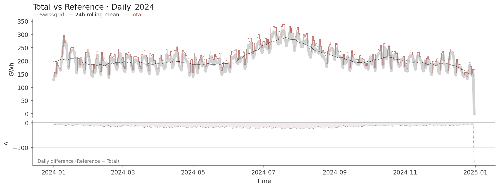

#### Per-type overview

All _types_ combined in one plot

```bash
nrgbnc plot compare indicator target \
  --variable all \
  --indicator-csv data/entsoe_hourly_2016_2025.csv \
  --target-csv data/sfoe_daily_2016_2025.csv \
  --start 2024-01-01 \
  --end 2024-12-31 \
  --combine
```

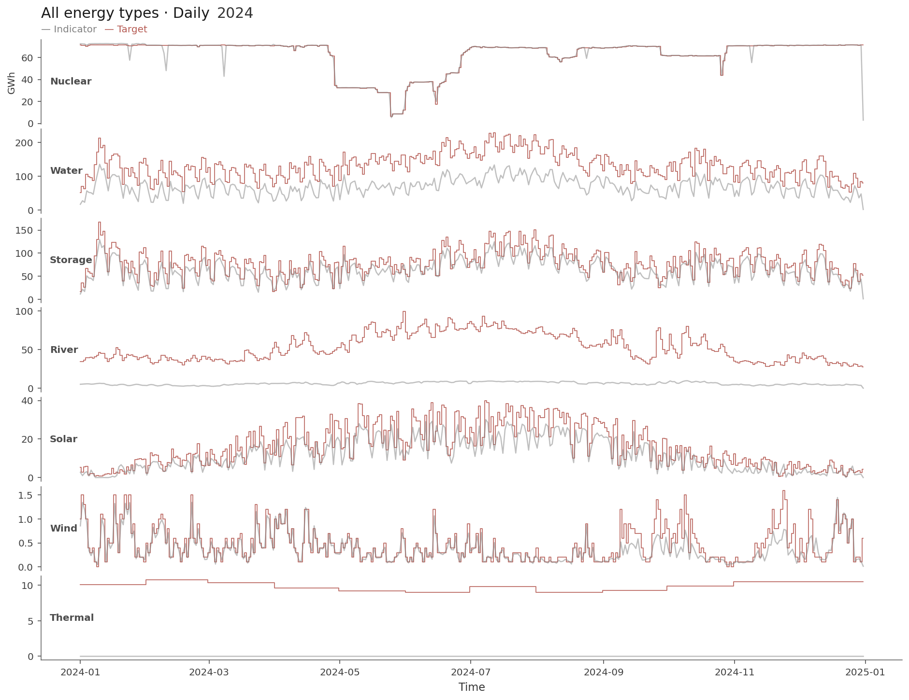

#### Bias detection

```bash
nrgbnc analyse autodetect-bias solar \
  --indicator-csv data/entsoe_hourly_2016_2025.csv \
  --target-csv data/sfoe_daily_2016_2025.csv \
  --start 2016-01-01 \
  --end 2024-12-31
```
```bash
..
📊 Generating bias overview plot...
💾 Plot saved to output/solar/solar_bias_detection_overview_2016_2024.png
..
```

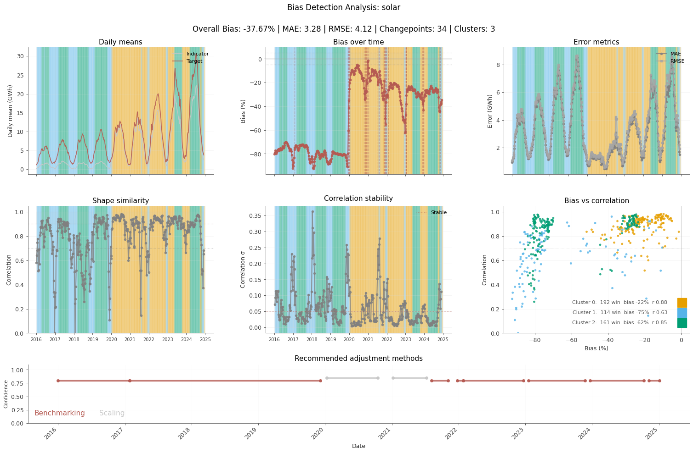

#### Metrics comparison

Indicator (hourly ENTSO-E) vs target (daily SFOE), all types

```bash
nrgbnc compare series indicator target \
  --variable all \
  --indicator-csv data/entsoe_hourly_2016_2025.csv \
  --target-csv data/sfoe_daily_2016_2025.csv \
  --start 2024-01-01 \
  --end 2024-12-31 \
  --output-csv indicator_vs_target_metrics.csv

nrgbnc plot metrics output/all/indicator_vs_target_metrics.csv
```

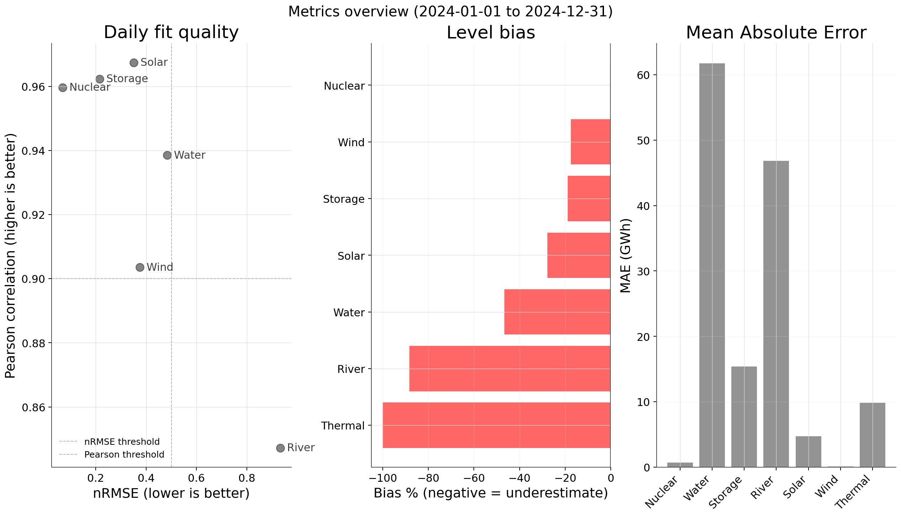

#### Scaling — water 

We scale the hourly energy production time series of all hydro-power types
(here labeled as `water`)

```bash
nrgbnc scale water \
  --indicator-csv data/entsoe_hourly_2016_2025.csv \
  --target-csv data/sfoe_daily_2016_2025.csv \
  --start 2024-01-01 \
  --end 2025-12-31
```

and plot the before and after time series
```bash
nrgbnc plot compare indicator adjusted \
  --variable water \
  --indicator-csv data/entsoe_hourly_2016_2025.csv \
  --adjusted-csv output/water/water_hourly_scaled_2024_2025.csv \
  --start 2024-01-01 \
  --end 2025-12-31 \
  --kind-of-adjusted scaled \
  --series1-label "ENTSO-E hourly" \
  --series2-label "Adjusted via scaling" \
  --no-difference-panel
```

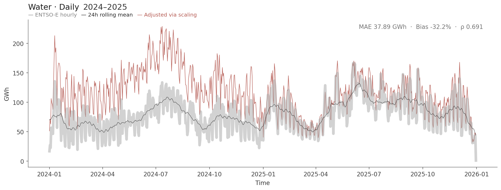

as well as the scaled against the target time series
```bash
nrgbnc plot compare adjusted target \
  --variable water \
  --adjusted-csv output/water/water_hourly_scaled_2024_2025.csv \
  --target-csv data/sfoe_daily_2016_2025.csv \
  --start 2024-01-01 \
  --end 2025-12-31 \
  --kind-of-adjusted scaled \
  --series1-label "ENTSO-E hourly" \
  --series2-label "SFOE (target)"
```

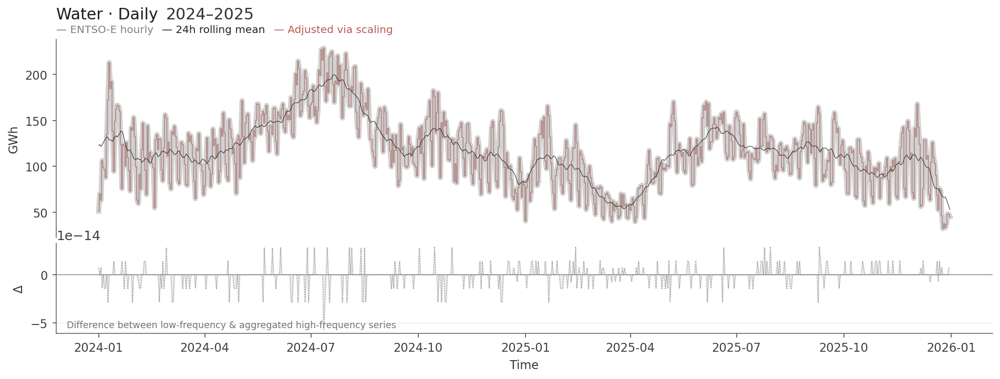

#### Temporal benchmarking — water


Benchmark via the default method which is Chow-Lin
(other methods can be selected via the `--method` option)
```bash
nrgbnc benchmark water \
  --indicator-csv data/entsoe_hourly_2016_2025.csv \
  --target-csv data/sfoe_daily_2016_2025.csv \
  --start 2024-01-01 \
  --end 2025-12-31
```

and plot the time series before and after the benchmarking
```bash
nrgbnc plot compare indicator adjusted \
  --variable water \
  --indicator-csv data/entsoe_hourly_2016_2025.csv \
  --adjusted-csv output/water/water_hourly_benchmarked_2024_2025.csv \
  --start 2024-01-01 \
  --end 2025-12-31 \
  --kind-of-adjusted benchmarked \
  --series1-label "ENTSO-E hourly" \
  --series2-label "Adjusted via benchmarking"
```

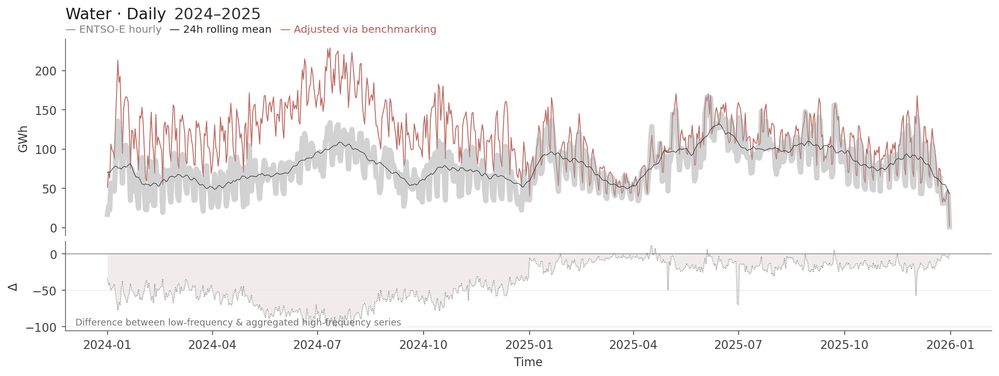
## Walk-thgough

A logical walkthrough from raw data to validated result,
using river hydro-power generation 2024–2025.

- **Preview** \
→ **Visualise** \
&nbsp; → **Scale** \
&nbsp;&nbsp;&nbsp; → **Inspect** \
&nbsp;&nbsp;&nbsp;&nbsp;&nbsp; → **Assess** \
&nbsp;&nbsp;&nbsp;&nbsp;&nbsp;&nbsp;&nbsp; → **Explore alternatives**

### 1. Preview the data

#### Describe

First,
we can get a statistical description of the both
the daily (SFOE) and the hourly (ENTSO-E) data

```bash
nrgbnc describe data/sfoe_daily_2016_2025.csv --datetime-column Date
```
```
     variable  count      sum      mean  median  min   max       std  missing
   Flusskraft   3653 170442.7 46.658281    41.7 13.2 106.0 18.393400        0
    Kernkraft   3653 218761.5 59.885437    68.6  6.4  79.5 15.380743        0
 Photovoltaik   3653  35914.0  9.831371     7.0  0.1  51.4  9.220640        0
Speicherkraft   3653 220625.5 60.395702    58.0  4.6 167.0 26.546136        0
   Thermische   3653  36665.6 10.037120     9.8  6.3  13.7  1.685646        0
         Wind   3653   1440.9  0.394443     0.3  0.0   1.6  0.284915        0
```

and

```bash
nrgbnc describe data/entsoe_hourly_2016_2025.csv
```
```
                       variable  count           sum     mean   median    min     max      std  missing
                          Solar  87649  22450.186545 0.256137 0.001930 0.0000 4.01776 0.563153       23
                   Wind Onshore  87649   1171.602969 0.013367 0.008560 0.0000 0.07626 0.013408       23
                     Fossil Gas      0      0.000000      NaN      NaN    NaN     NaN      NaN    87672
                        Nuclear  87672 220741.036340 2.517805 2.896900 0.0000 3.39170 0.673453        0
           Hydro Pumped Storage  87672  69946.625020 0.797822 0.471075 0.0000 4.22460 0.810512        0
          Hydro Water Reservoir  87672 104447.775400 1.191347 0.915490 0.0296 4.15318 0.849802        0
Hydro Run-of-river and poundage  87432  29704.326967 0.339742 0.196800 0.0000 3.67410 0.489872      240
```

> From here and on,
> we refer to the daily data (SFOE low-frequency time series) as _target_
> and the hourly data (high-frequency time series) as _indicator_.

#### 2. Visualise

First, we plot the indicator against the target time series
to inspect the differences visually.

```bash
nrgbnc plot compare indicator target \
  --variable river \
  --indicator-csv data/entsoe_hourly_2016_2025.csv \
  --target-csv data/sfoe_daily_2016_2025.csv \
  --start 2024-01-01 \
  --end 2025-12-31 \
  --series1-label "ENTSO-E (indicator)" \
  --series2-label "SFOE (target)"
```
```
...
💾 Plot saved to output/river/river_indicator_vs_target_2024_2025.png
```


#### Compare

Next,
we compare the **indicator** (ENTSO-E hourly, yet aggregated to daily)
with the **target** (SFOE daily) time series

```bash
nrgbnc compare series indicator target \
  --variable river \
  --indicator-csv data/entsoe_hourly_2016_2025.csv \
  --target-csv data/sfoe_daily_2016_2025.csv \
  --start 2024-01-01 \
  --end 2025-12-31 \
  --output-csv indicator_vs_target_2024_2025_metrics.csv 
```
```
📖 Loading indicator series...
📖 Loading target series...
📊 Aggregating to daily frequency...
🔬 Calculating comparison metrics...

======================================================================
📊 Comparison: INDICATOR vs TARGET
======================================================================
Variable: River
Period: 2024-01-01 to 2025-12-31
Days: 731

Summary Statistics:
  Indicator - Mean: 22.9277 GWh, Std: 19.7242 GWh, Sum: 16760.18 GWh
  Target - Mean: 48.8755 GWh, Std: 17.7393 GWh, Sum: 35728.00 GWh

Comparison Metrics:
  Pearson correlation: 0.1693
  Spearman correlation: 0.2343
  Cosine similarity: 0.7505

Error Metrics:
  Mean Bias Error (MBE): -25.9478 GWh
  Mean Absolute Error (MAE): 25.9738 GWh
  Root Mean Square Error (RMSE): 35.4650 GWh
  Normalized RMSE: 0.73%
  SMAPE: 0.85%
  Bias: -53.09%

Temporal Analysis:
  Best lag: 0.0 days
  Correlation at best lag: 0.1693
======================================================================

            comparison variable      start        end  n_days  n_overlap   pearson  spearman    cosine        mbe  ...     smape     mean_a     mean_b      std_a     std_b         sum_a    sum_b  best_lag  best_lag_corr   bias_pct
0  indicator_vs_target    river 2024-01-01 2025-12-31     731      731.0  0.169265  0.234334  0.750485 -25.947767  ...  0.845899  22.927746  48.875513  19.724199  17.73935  16760.182377  35728.0       0.0       0.169265 -53.089503

[1 rows x 23 columns]
```

This shows how the hourly ENTSO-E _indicator_ sums up
against the official SFOE _daily_ targets.
_If the indicator is undereported_, _daily sums will be systematically lower_.

Instead of reading the output on-screen,
we can save the metrics as comma-separated-values

```bash
nrgbnc compare series indicator target \
  --variable river \
  --indicator-csv data/entsoe_hourly_2016_2025.csv \
  --target-csv data/sfoe_daily_2016_2025.csv \
  --start 2024-01-01 \
  --end 2025-12-31 \
  --output-csv indicator_vs_target_2024_2025_metrics.csv 
```

and plot them via a dedicated command

```bash
nrgbnc plot metrics output/river/river_indicator_vs_target_2024_2025_metrics.csv
```
```
💾 Plot saved to output/river/river_indicator_vs_target_2024_2025_metrics.png
```


We can also let `nrgbnc` run an automated bias detection

```bash
nrgbnc analyse autodetect-bias river \
  --indicator-csv data/entsoe_hourly_2016_2025.csv \
  --target-csv data/sfoe_daily_2016_2025.csv \
  --start 2023-01-01 \
  --end 2025-12-31
```

and plot the generated overview `output/river/river_bias_detection_overview_2023_2025.png`

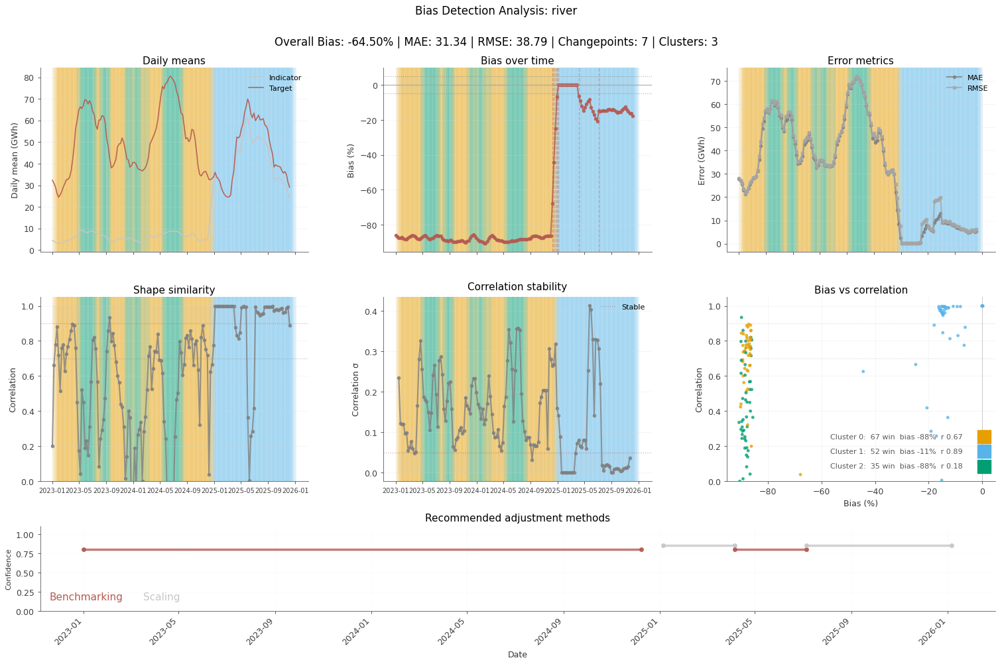

### 3. Scaling

We scale the indicator's hourly data on a _per-day_ basis
to match the daily totals of the target.

```bash
nrgbnc scale river \
  --indicator-csv data/entsoe_hourly_2016_2025.csv \
  --target-csv data/sfoe_daily_2016_2025.csv \
  --start 2024-01-01 \
  --end 2025-12-31
```
```
⚠  Warning: 82 days have extreme scaling factors (>10.0x):
   2024-01-16: factor=10.4x (daily_sum=3.7787 GWh, target=39.40 GWh)
   2024-01-17: factor=10.5x (daily_sum=4.1426 GWh, target=43.60 GWh)
   2024-01-18: factor=13.4x (daily_sum=3.9275 GWh, target=52.60 GWh)
   2024-01-19: factor=10.5x (daily_sum=4.7781 GWh, target=50.20 GWh)
   2024-01-23: factor=12.5x (daily_sum=3.5187 GWh, target=43.90 GWh)
   ... and 77 more days
💾 CSV saved to output/river/river_hourly_scaled_2024_2025.csv
```

and quick-check the adjusted series

```bash
nrgbnc describe output/river/river_hourly_scaled_2024_2025.csv
```
```
        variable  count           sum      mean    median      min     max      std  missing
       river_gwh  17521  16760.182377  0.956577  0.421900 0.079750  3.6741 0.824365        0
river_scaled_gwh  17521  35728.000000  2.039153  1.879266 0.345302 20.4000 0.795163        0
            hour  17521 201480.000000 11.499344 11.000000 0.000000 23.0000 6.922732        0
           month  17521 114108.000000  6.512642  7.000000 1.000000 12.0000 3.446190        0
```

For each day,
the hourly values are multiplied by the ratio `target / sum(indicator)`
for that day.
The assumption in this approach is that the hourly shape is correct.
On the downside,
simple scaling may introduce extreme values
in the case of incomplete indicator series.
To this end, a few optional constraints
prevent very small values from blowing up under large factors
or preserve zero hourly values after the adjustment.

> Optional constraints to the `scale` command :
> `--min-value`, `--preserve-zeros`, `--min-daily-sum`.

### 4. Inspect the result

Following,
we compare the input and output time series

#### Original vs adjusted

##### Plot original vs adjusted side-by-side

```bash
nrgbnc plot compare indicator adjusted \
  --variable river \
  --indicator-csv data/entsoe_hourly_2016_2025.csv \
  --adjusted-csv output/river/river_hourly_scaled_2024_2025.csv \
  --start 2024-01-01 \
  --end 2025-12-31 \
  --kind-of-adjusted scaled \
  --series1-label "ENTSO-E (indicator)" \
  --series2-label "Adjusted via simple scaling"
```
```
...
💾 Plot saved to output/river/river_indicator_vs_adjusted_scaled_2024_2025.png
```

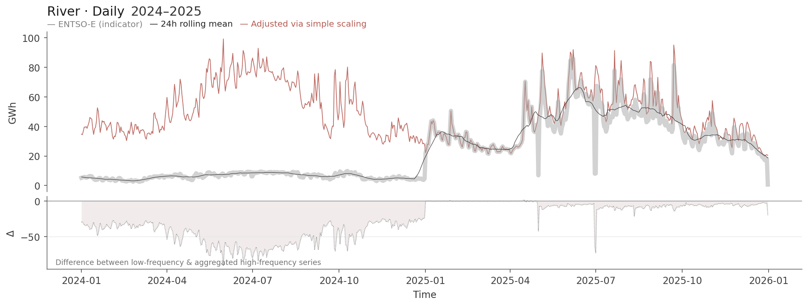
##### How much did scaling change things ?

```bash
nrgbnc compare series indicator adjusted \
  --variable river \
  --indicator-csv data/entsoe_hourly_2016_2025.csv \
  --adjusted-csv output/river/river_hourly_scaled_2024_2025.csv \
  --kind-of-adjusted scaled \
  --start 2024-01-01 \
  --end 2025-12-31 \
  --output-csv indicator_vs_adjusted_scaled_2024_2025_metrics.csv
```
...bash
💾 CSV saved to output/river/river_indicator_vs_adjusted_scaled_2024_2025_metrics.png
```

and plot the metrics

```bash
nrgbnc plot metrics output/river/river_indicator_vs_target_2024_2025_metrics.csv
```
```
💾 Plot saved to output/indicator_vs_adjusted_2024_2025_metrics.png
```

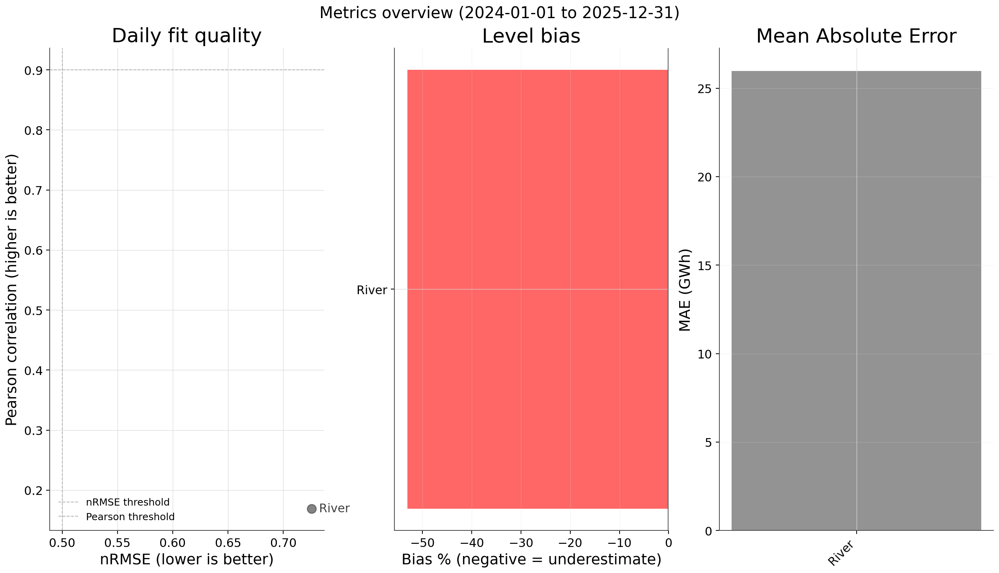

#### Adjusted vs target

```bash
nrgbnc plot compare adjusted target \
  --variable river \
  --adjusted-csv output/river/river_hourly_scaled_2024_2025.csv \
  --target-csv data/sfoe_daily_2016_2025.csv \
  --start 2024-01-01 \
  --end 2025-12-31 \
  --kind-of-adjusted scaled
```
```
...
💾 Plot saved to output/river/river_adjusted_vs_target_scaled_2024_2025.png
```

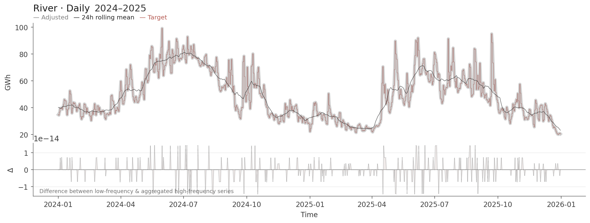

### 5. Assess quality with metrics

##### Does the scaled version sum correctly ?

We run the comparison command to get statistics like MAE, RMSE, bias, etc.

```bash
nrgbnc compare series adjusted target \
  --variable river \
  --adjusted-csv output/river/river_hourly_scaled_2024_2025.csv \
  --target-csv data/sfoe_daily_2016_2025.csv \
  --start 2024-01-01 \
  --end 2025-12-31 \
  --kind-of-adjusted scaled \
  --output-csv adjusted_vs_target_2024_2025_metrics.csv
```

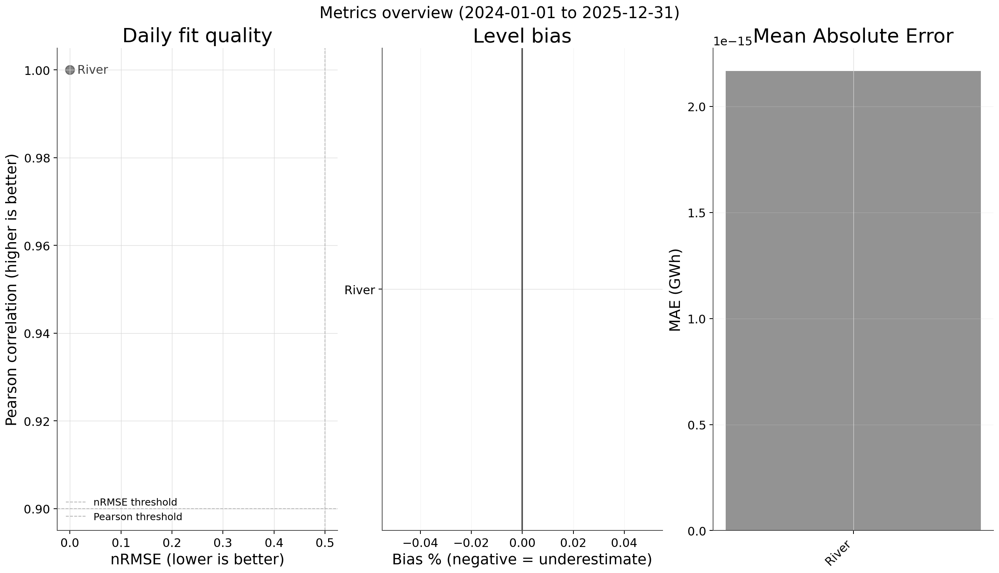

We compute and plot error metrics against the target

```bash
nrgbnc plot metrics output/river/river_adjusted_vs_target_2024_2025_metrics.csv
```
```bash
💾 Plot saved to output/river_adjusted_vs_target_2024_2025_metrics.png
```


Examine the output for MAE, RMSE, daily sum accuracy, and possible temporal bias patterns.

### 6. Explore alternatives

#### Benchmarking — Chow-Lin

Perform the benchmarking

```bash
nrgbnc benchmark river \
  --indicator-csv data/entsoe_hourly_2016_2025.csv \
  --target-csv data/sfoe_daily_2016_2025.csv \
  --start 2024-01-01 \
  --end 2025-12-31
```
```
Temporal Disaggregation Model Summary
==================================================

Method: chow-lin
Estimated rho: 0.5000
      Coef.    Std.Err.        t-stat       P>|t| Signif.       Score
1.289811795 0.005981569 215.631019603 0.000000000     *** 0.000000000
None
💾 CSV saved to output/river/river_hourly_benchmarked_2024_2025.csv
```

and plot the adjusted series against the target

```bash
nrgbnc plot compare adjusted target \
  --adjusted-csv output/river/river_hourly_benchmarked_2024_2025.csv \
  --target-csv data/sfoe_daily_2016_2025.csv \
  --start 2024-01-01 \
  --end 2025-12-31 \
  --variable river \
  --series1-label "Adjusted via Chow-Lin"  \
  --series2-label "SFOE"
```
```
...
💾 Plot saved to output/river/river_adjusted_vs_target_benchmarked_2024_2025.png
```

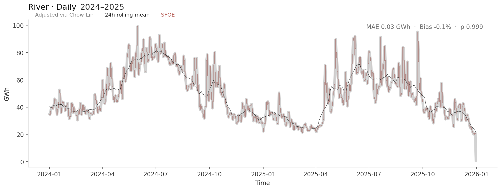

#### UKF — experimental

The Unscented Kalman Filter is an alternative smoothing approach:
it tracks log-generation hour-by-hour, then reconciles each day
to the target (proportional scaling).  In practice it produces
near-identical results to `scale` for well-behaved series
(nuclear, river, storage), but differs for zero-heavy types
(solar, thermal) where the log-space transform changes the
within-day distribution.

```bash
nrgbnc kalman ukf river \
  --indicator-csv data/entsoe_hourly_2016_2025.csv \
  --target-csv data/sfoe_daily_2016_2025.csv \
  --start 2024-01-01 \
  --end 2025-12-31
```
```
> UKF-disaggregated (17521 hours, 730 days)
💾 CSV saved to output/river/river_hourly_ukf_disaggregated_2024_2025.csv
```

Plot the adjusted against the target time series

```bash
nrgbnc plot compare adjusted target \
  --adjusted-csv output/river/river_hourly_ukf_disaggregated_2024_2025.csv \
  --target-csv data/sfoe_daily_2016_2025.csv \
  --start 2024-01-01 \
  --end 2025-12-31 \
  --variable river \
  --kind-of-adjusted ukf \
  --series1-label "UKF disaggregated" \
  --series2-label "SFOE"
```
```bash
...
💾 Plot saved to output/river/river_adjusted_vs_target_ukf_2024_2025.png
```

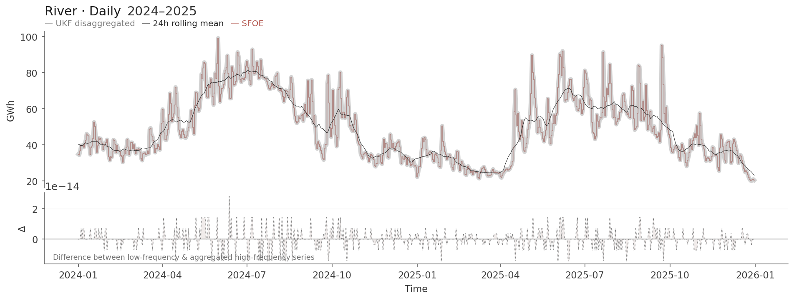

### 7. Compare methods

Rather than running separate comparisons,
we can use the unified comparison command:

```bash
nrgbnc analyse compare-methods river \
  --indicator-csv data/entsoe_hourly_2016_2025.csv \
  --target-csv data/sfoe_daily_2016_2025.csv \
  --start 2024-01-01 \
  --end 2025-12-31
```
```bash
Comparing adjustment methods for River...
  Methods: scaling, benchmarking, ukf
  Period:  2024-01-01 to 2025-12-31

                 MAE→ind  RMSE→ind Pearson→ind  Daily Bias%  Adjusted Sum  Target Sum
-------------------------------------------------------------------------------------
     indicator    25.974    35.465    0.1693           —     16760.2     35728.0
        target         —         —         —           —           —     35728.0
       scaling     1.084     1.502    0.1727      0.0000     35728.0     16760.2
  benchmarking     1.083     1.479    0.1761     -0.0548     35708.4     16760.2
           ukf     1.084     1.502    0.1727      0.0000     35728.0     16760.2
-------------------------------------------------------------------------------------

Least shape change: benchmarking (MAE vs indicator = 1.083)
Most shape change:  scaling (MAE vs indicator = 1.084)
All methods match daily targets (DailyBias% ≈ 0).
* ind : indicator
```

This runs scaling, benchmarking (Chow-Lin), and UKF on the same data
and shows how much each method changes the hourly shape relative to
the raw indicator (MAE, RMSE, Pearson) plus a daily-sum accuracy check.

| Metric | What it tells you |
|--------|-------------------|
| MAE→ind | Hourly difference from raw indicator — lower = preserves shape better |
| Pearson→ind | Shape correlation with raw indicator — higher = less distortion |
| DailyBias% | Should be ~0 for all methods (all match daily totals by construction) |

### 8. Automated recommendations

Rather than guessing which method to apply, use bias detection
to let the data decide:

```bash
nrgbnc analyse autodetect-bias river \
  --indicator-csv data/entsoe_hourly_2016_2025.csv \
  --target-csv data/sfoe_daily_2016_2025.csv \
  --start 2024-01-01 \
  --end 2025-12-31
```

> Note, the command offers also some lower-level control like :
> `--window-size`, `--step-size`, `--n-clusters`,
> `--changepoint-method`, `--changepoint-threshold`

This divides the period into subperiods with similar bias
characteristics, detects changepoints where bias shifts
abruptly, and recommends a method per subperiod.

Output shows recommendations like:

```
1. 2024-12-30 to 2025-04-07: scaling (confidence: 85.0%)
   Reason: Low bias with good correlation - scaling sufficient

2. 2025-04-07 to 2025-06-02: scaling (confidence: 85.0%)
   Reason: Low bias with good correlation - scaling sufficient

3. 2025-07-07 to 2026-01-07: scaling (confidence: 85.0%)
   Reason: Low bias with good correlation - scaling sufficient

4. 2024-01-01 to 2024-12-09: benchmarking (confidence: 80.0%)
   Reason: High bias (-88.2%) or low correlation (0.46) suggests temporal disaggregation

5. 2025-06-02 to 2025-07-07: benchmarking (confidence: 80.0%)
   Reason: High bias (-17.3%) or low correlation (0.25) suggests temporal disaggregation
```

These recommendations are also saved as a CSV for
further analysis or pipelining into an assembly workflow.

---

### See also

**Tip**: When data quality varies over time (e.g., 2016–2024 vs. 2025+),
process each period with the most suitable method
and assemble them into a single series.

See `docs/assembled-series-guide.md`.
For more comparison examples, see `docs/unified-comparison-examples.md`.

## Architecture

```bash
src/energybench/
├── cli/       # Commands (benchmark, compare, plot, validate, analyse)
├── core/      # Configuration, metrics, validation
├── models/    # Algorithms (benchmarking, disaggregation, scaling, kalman)
└── io/        # Reading, writing, fetching
```


## Terminology

Energy-Bench uses _source-agnostic_ terminology
to support any time series data sources, not just ENTSO-E and SFOE.

### Core Concepts

- **Indicator**: High-frequency time series to be adjusted (e.g., ENTSO-E hourly, Swissgrid 15-min, or any custom source)
- **Target**: Low-frequency reference values (e.g., SFOE daily, or any authoritative source)
- **Adjusted/Benchmarked**: Output after benchmarking (hourly values that sum to daily targets)
- **Original**: Unadjusted indicator values
- **Scaled**: Output after simple scaling operations

### Naming Conventions

| Concept               | Parameter Name          | Example                         |
|-----------------------|-------------------------|---------------------------------|
| Indicator CSV file    | `indicator_csv`         | `entsoe_hourly.csv`             |
| Target CSV file       | `target_csv`            | `sfoe_daily.csv`                |
| Adjusted CSV file     | `adjusted_csv`          | `river_benchmarked.csv`         |
| Indicator time column | `indicator_time_column` | `"DateTime"`                    |
| Target time column    | `target_time_column`    | `"Date"`                        |
| Indicator columns     | `indicator_fields`      | `["Nuclear", "Solar"]`          |
| Target columns        | `target_fields`         | `["Kernkraft", "Photovoltaik"]` |
| Original values       | `original_column`       | `"nuclear_original_gwh"`        |
| Scaled columns        | `scaled_column`         | `"river_scaled_gwh"`            |
| Benchmarked output    | `benchmarked_column`    | `"nuclear_benchmarked_gwh"`     |

### Source Provenance

All outputs include metadata tracking data sources:

- `indicator_source`: Name of indicator data source (e.g., "ENTSO-E", "Swissgrid", "CustomAPI")
- `target_source`: Name of target data source (e.g., "SFOE", "CustomReference")

## Documentation

<!-- - `docs/river-example-2023-2025.md` — Step-by-step example -->
<!-- - `docs/assembled-series-guide.md` — Complete workflow guide -->
<!-- - `docs/unified-comparison-examples.md` — Comparison command examples -->
<!-- - `docs/REVIEW_GUIDE.md` — 15-minute review checklist -->
<!-- - `docs/temporal-disaggregation-methodology.md` — Method details -->
<!-- - `docs/automated-bias-detection-guide.md` — Bias detection workflow -->
<!-- - `docs/scaling-validation-guide.md` — Scaling method validation -->
- `AGENTS.md` — Comprehensive developer guide for the codebase

## License

This work is dedicated to the public domain under [CC0 1.0 Universal](https://creativecommons.org/publicdomain/zero/1.0/).

You may copy, modify, distribute, and use the work, even for commercial purposes, without asking permission.

---

**Last Updated**: 2026-05-27  
**Version**: 0.2.0  
**Status**: Development
